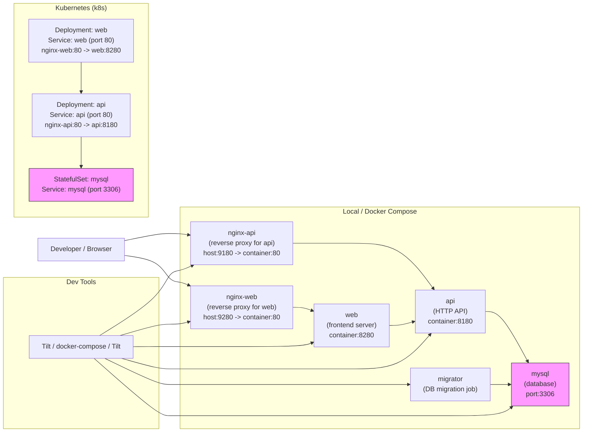

# taskapp/workbench/app

このディレクトリは `taskapp` のローカル開発用ワークスペースです（API、Web、補助ツール、コンテナ、Kubernetes 設定を含む）。

以下は簡潔にまとめたディレクトリ構成と役割です。詳細は各ディレクトリ内のファイルを参照してください。

## 構成ハイレベル

- `Makefile` — ビルド、依存管理、DB マイグレーション、ユーティリティコマンド。
- `compose.yaml` — ローカル起動用の Docker Compose 定義。
- `Tiltfile` — Tilt を使った開発ランナー（Compose を呼び出すことが多い）。
- `api-config.yaml` — API の設定テンプレート（k8s 用にコピーすることがある）。
- `assets/` — Web アセット（例: `bootstrap.min.css`）。
- `bin/` — ビルド成果物（`make build-...` 出力）。
- `cmd/` — 実行可能バイナリのエントリポイント（`api/`, `web/`, `tools/`）。
- `containers/` — 各サービスの `Dockerfile`（`api`, `web`, `mysql`, `migrator`, `nginx-api`, `nginx-web` 等）。
- `k8s/` — kustomize を主体とした Kubernetes マニフェスト（`kustomize/base` にベース定義）。
- `pkg/` — アプリ本体の Go パッケージ（`app`, `db`, `model`, `cli` など）。
- `secrets/` — ローカル用シークレットファイル（`mysql_root_password` 等）。

## よく使う Make タスク

- `make install-tools` — 開発ツールをインストール（`hack/install-tools.sh` を利用）。
- `make build-<name>` — `cmd/<name>` をビルドして `bin/<name>` を作成（例: `make build-api`）。
- `make serve-api` / `make serve-web` — 各アプリをローカル起動。
- `make make-mysql-passwords` — `secrets` を生成して k8s 用にコピー。
- `make api-config.yaml` — `api-config.yaml` を生成し `k8s/kustomize/base/api/` に配置。
- `make generate-db-model` — `sqlboiler` で DB モデルを生成（DB 情報に依存）。

簡単な読み方:

- `nginx-web` はフロントエンド向けのリバースプロキシで `web` にルーティングします。
- `nginx-api` は API へのリクエストを `api` にルーティングします。
- `web` は API を呼び、`api` は `mysql` を参照します。
- `migrator` は DB マイグレーション用のジョブで `mysql` に対してスキーマ操作を行います。
